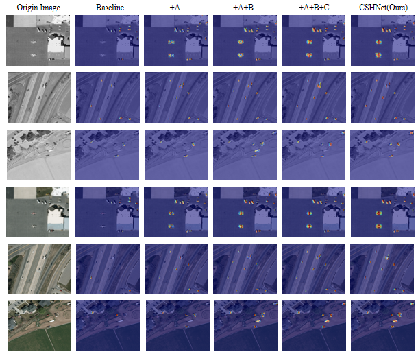
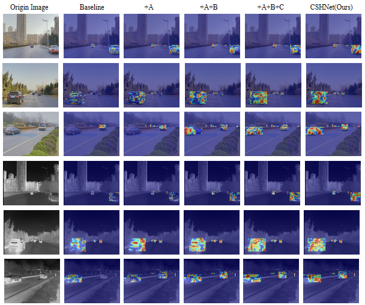
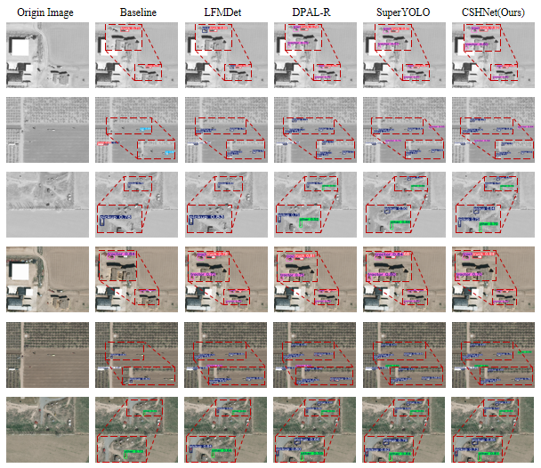
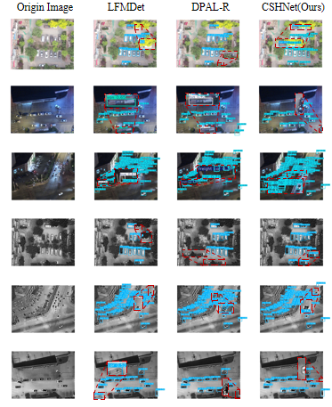

# CSHNet: Cross-modal Semantic Hypergraph Network for UAV Multimodal Object Detection

RGB-T object detection framework for UAV remote sensing, built on RT-DETR-R18.

## Overview

CSHNet addresses four structural limitations of existing dual-stream detectors through four targeted modules:

- **CSAM** — establishes cross-modal semantic correspondence at P3 via bidirectional channel cross-attention and spatial attention refinement
- **PGRM** — replaces the spatial-domain encoder with Haar wavelet subband decomposition and prototype-guided residual modulation
- **HGAM** — models high-order non-adjacent cross-scale dependencies via hypergraph convolution (HCSE), with DRFM top-level refinement and GRFM gated bypass connections
- **HFIM** — integrates backbone- and encoder-retained features with neck-enhanced outputs at the decoder entry across P3/P4/P5

## Results

| Dataset | mAP50 | mAP50:95 | Notes |
|---------|-------|----------|-------|
| M3FD | 60.2% | 38.8% | — |
| VEDAI | 82.5% | 55.1% | — |
| DroneVehicle | 61.6% | 31.6% | Zero-shot from M3FD |

## Visualizations

### Grad-CAM Activation Heatmaps — VEDAI

Incremental effect of each module from baseline to full CSHNet.



### Grad-CAM Activation Heatmaps — M3FD



### Detection Results — VEDAI

Comparison with LFMDet, DPAL-R, SuperYOLO, and baseline.



### Detection Results — M3FD


### Detection Results — DroneVehicle (Zero-shot)



## Requirements

```
Python >= 3.10
PyTorch >= 2.0
CUDA >= 11.8
```

Install dependencies:

```bash
pip install -r requirements.txt
```

## Dataset Preparation

Organize your dataset in the following structure:

```
datasets/
└── M3FD_split/
    ├── images/       # RGB images
    ├── images_ir/    # Infrared images
    └── labels/
```

Update the `path` field in `ultralytics/cfg/datasets/mmdata/data.yaml` to your local dataset root.

## Training

```python
from ultralytics import RTDETRMM

model = RTDETRMM('CSHNet.yaml')
model.train(
    data='ultralytics/cfg/datasets/mmdata/data.yaml',
    epochs=50,
    device=0,
    batch=16,
    project='runs',
    name='CSHNet'
)
```

Or run directly:

```bash
python trainRT.py
```

## Inference

Dual-modal inference (RGB + Infrared):

```python
from ultralytics import RTDETRMM

model = RTDETRMM('path/to/best.pt')
model.predict(
    rgb_source='path/to/rgb_image.png',
    x_source='path/to/ir_image.png',
    save=True
)
```

Single-modal inference is supported by setting the unused modality to `None`.

## Model Configurations

| File | Description |
|------|-------------|
| `CSHNet.yaml` | Full model architecture |
| `CSAM.yaml` | Cross-modal Semantic Alignment Module |
| `PGRM.yaml` | Prototype Guided Residual Modulation |
| `HGAM.yaml` | Hypergraph Guided Aggregation Module |
| `HFIM.yaml` | Hierarchical Feature Integration Module |

## Citation

```bibtex
@article{cshnet2025,
  title={Cross-modal Semantic Hypergraph Network for RGB-T Object Detection in UAV Remote Sensing},
  author={Qi Tian and Tingyao Jiang and Hao Zhang},
  journal={},
  year={2025}
}
```

## Acknowledgements

Built upon [Ultralytics](https://github.com/ultralytics/ultralytics). Datasets: [M3FD](https://github.com/JinyuanLiu-CV/TarDAL), [VEDAI](https://downloads.greyc.fr/vedai/), [DroneVehicle](https://github.com/VisDrone/DroneVehicle).
